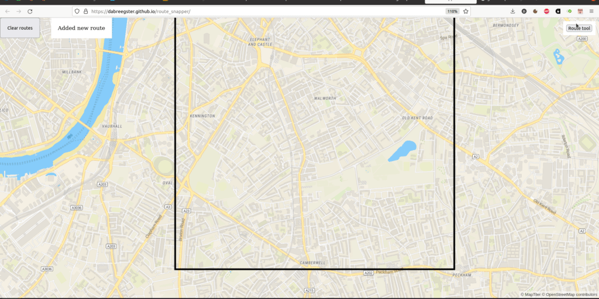

# MapLibre route snapper

[](https://www.npmjs.com/package/route-snapper)

This plugin lets you draw routes and polygon areas in MapLibre GL that snap to some network (streets, usually). Unlike similar plugins that send a request to a remote API for routing, this one does the routing client-side. This works by loading a pre-built file covering a fixed area and calculating the routes locally.

[Demo](https://dabreegster.github.io/route_snapper)



## Usage

See the [user guide](user_guide.md) for full details and examples.

1.  Build a graph file covering some fixed area
2.  `npm install route-snapper`
3.  Construct the `RouteSnapper` object, passing in the graph file a MapLibre map
4.  Listen to events to use the drawn routes

## Development

`route-snapper` is written in Rust, compiled to WASM to run in the browser, and has a simple Javascript wrapper library. You need [wasm-pack](https://rustwasm.github.io/wasm-pack/installer/) and Python (to run a local server).

```
cd examples
./serve_locally.sh
```

## Contributing

There are many ideas for improving this plugin, such as customizing the instructions, controls, and route style, and generating graph files on-the-fly from vector tile data. Check out the [issues](https://github.com/dabreegster/route_snapper/issues) or start your own.

This project follows the [Rust code of conduct](https://www.rust-lang.org/policies/code-of-conduct) and is Apache 2.0 licensed.

## Related work

This tool started life in fall 2021 through [Ungap the Map](https://a-b-street.github.io/docs/software/ungap_the_map/index.html), for sketching potential cycle lanes along existing roads. It used a custom UI and map rendering library built on top of OpenGL. A year later, the idea was adapted to work in [ATIP](https://github.com/acteng/atip), using MapLibre GL. The functionality for dragging waypoints is partly inspired by [Felt](https://felt.com), Google Maps, and similar products.

Other projects with client-side routing: [ngraph.path](https://github.com/anvaka/ngraph.path.demo)
